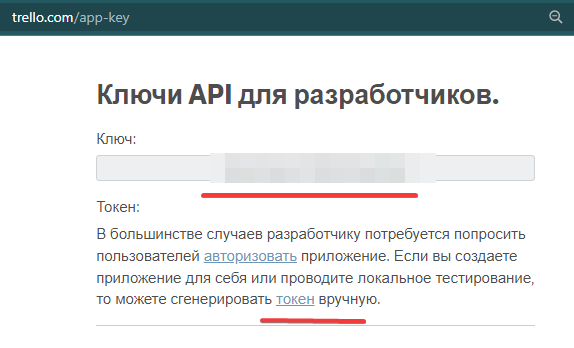
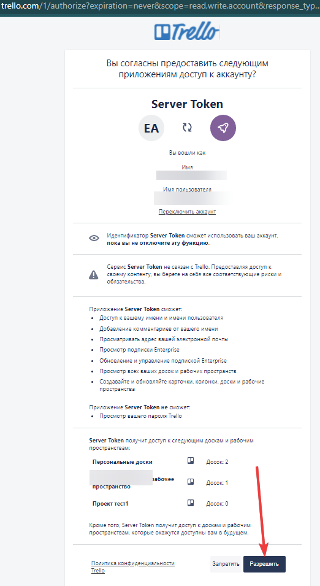

# devman_projects_automation
Программа для автоматизации формирования команд учебных проектов devman


## Получение доступа к API TRELLO
Зарегистрируйтесь на trello.com
На странице [Ключи API для разработчиков](https://trello.com/app-key) получите `API ключ` разработчика.



Сгенерируйте токен вручную.


Сохраните в `.env` (в каталоге рядом с manage.py) полученный API ключ и токен
```
# sample trello key
TRELLO_API_KEY=X4X9e2X5XX623c7XX0b9dcX1XXb32aXX
TRELLO_TOKEN=XXdb498de7add3d083a9bfXXXXe2e9729bd4368172244c071690a8bXd0937bXX
```